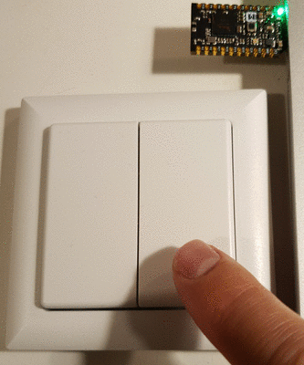

ptm216z
=======
Receive packets of energy harvesting switch PTM216Z on a Nordic nRF52840

Switch
---------
The energy harvesting switch is a [PTM 216Z](https://www.enocean.com/de/produkte/enocean_module_24ghz/ptm-216z/) from EnOcean. 

Receiver
-----------
The receiver is a [Makerdiary USB dongle](https://wiki.makerdiary.com/nrf52840-mdk-usb-dongle/).
Install arm-gcc, make the project and use [nRF Connect](https://www.nordicsemi.com/Software-and-tools/Development-Tools/nRF-Connect-for-desktop)
to flash the receiver (build/receiver.hex) onto the dongle.

Sender
---------
For testing there is also a sender that emulates the PTM 216Z. Flash it onto a second USB dongle and push the button.
